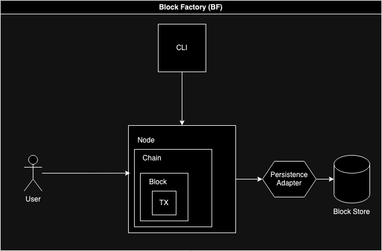

# sqlite block factory

- [x] Concurrent (with tokio)
- [ ] Observable (with tracing)

Generating consensus-less blocks from incoming transactions

# Objects

## `Transaction`

- Basic unit of interaction with Node
- Hold transaction details

## `Block`

- Structure for immutably storing transactions

## `Chain`

- Manage block creation and chaining

## `Node`

- Run the block factory
- Handle data persistency

## `Persistence`

- Gateway to database I/O
- Abstract database implementation
- Allow different Database services (e.g. sqlite, postgres)

# Configuration Flags

> Tip: Run `block-factory --help` for a full list of configuration flags.

- `p` and `--port` (Usage: `block-factory --port 8080`)

- `b` and `--block-time` (Usage: `block-factory --block-time 1`)

- `m` and `--mode` (Usage: `block-factory --mode full`, Options: `full`, `factory-only`, `query-only`

# API Groups

`/api` - For all API / Data interactions

`/` - For all UI rendering
